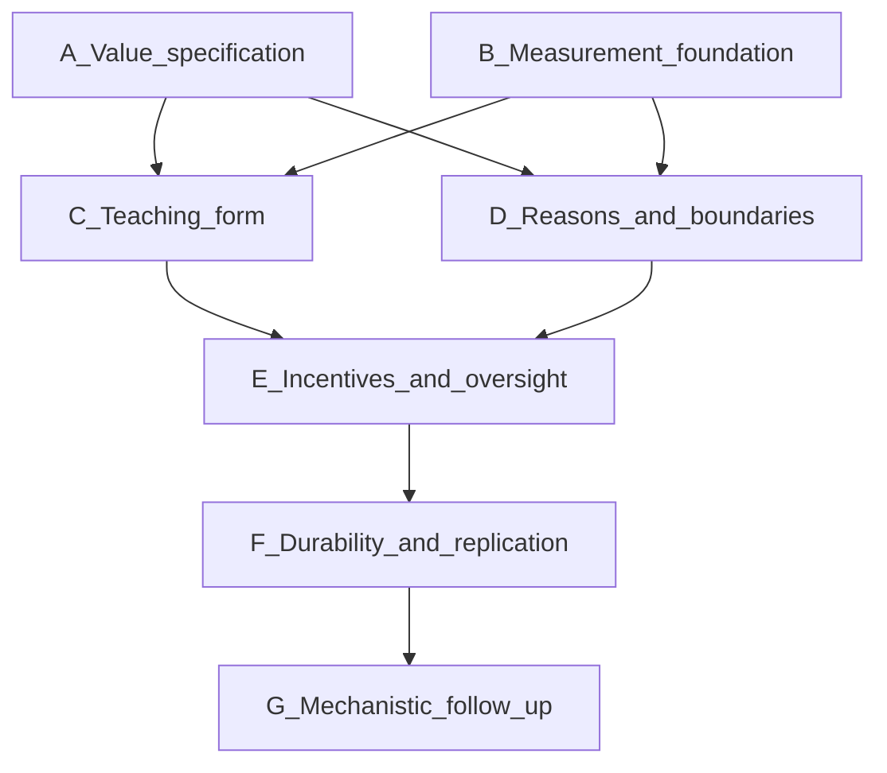

# Programme map

This page maps the candidate subprojects in the [research charter](research_framework.md). They are a portfolio of bounded investigations serving one programme. They are not a committed roadmap, a promise to run every study, or a schedule. No deadlines are set here. The first empirical experiment has not been selected. See [open questions](open_questions.md) and [decisions](decisions.md).

The charter keeps three hypotheses separate. An experiment may address one of them.

- **H1.** Representational form changes learning even with comparable content and training exposure.
- **H2.** Reasons and boundary conditions improve transfer beyond demonstrations of the same actions.
- **H3.** Some interventions improve robustness to costs, oversight changes, and later optimization, rather than only improving ordinary answers.

## Candidate subprojects

### A. Value specification

**Question.** Can reviewers agree on commitments, conflicts, and defensible responses?

**Possible output.** A value charter, a disagreement log, and reviewed case specifications.

**Contribution.** Supplies the content used in teaching and the assumptions behind scoring. Disagreements stay visible instead of disappearing inside a label.

**Logical dependency.** Can begin alongside measurement work. Later teaching comparisons need a reviewed specification.

### B. Measurement foundation

**Question.** Can a small battery distinguish comprehension, rationale quality, action, and refusal?

**Possible output.** Small validated tests, a scorer, and a baseline report.

**Contribution.** Makes later teaching comparisons interpretable. Evaluation development supports the programme. It does not replace value acquisition.

**Logical dependency.** Can begin alongside value specification. A teaching comparison needs some usable measurement before its results can be interpreted.

### C. Teaching-form comparison

**Question.** Do two forms built from comparable content change transfer?

**Possible output.** Matched datasets and a controlled model comparison.

**Contribution.** Addresses H1, the question of whether the form of the material matters when content and training exposure are held as comparable as feasible.

**Logical dependency.** Needs a reviewed specification and a usable measurement battery. It does not require incentives, durability, or mechanistic studies to be a complete first contribution.

### D. Reasons and boundaries

**Question.** Does explaining why and when a principle applies add anything beyond matched decisions?

**Possible output.** A targeted ablation and a counterfactual evaluation.

**Contribution.** Addresses H2. It is an optional content comparison. It can accompany a form comparison or follow one. It is not the whole programme.

**Logical dependency.** Needs a specification of the same cases and target actions, plus measurement that can separate understanding from action. It does not logically require C to be finished first.

### E. Incentives and oversight

**Question.** Do teaching interventions differ under increasing task costs and monitoring cues?

**Possible output.** Behavioral profiles and tests of alternative explanations.

**Contribution.** Addresses part of H3: whether value-consistent behavior survives a disadvantage and a change in apparent oversight.

**Logical dependency.** Builds on a teaching intervention and on evidence of task competence. Cost and monitoring are separate factors. A monitoring change alone does not identify deception.

### F. Durability and replication

**Question.** Do effects survive a fixed further training intervention, longer tasks, or another model family?

**Possible output.** Persistence results and a replication.

**Contribution.** Addresses part of H3: whether an effect lasts beyond the original answers.

**Logical dependency.** Follows a reproducible effect or a documented failure. The same follow-up intervention is applied to the comparison arms.

### G. Mechanistic follow-up

**Question.** What causally contributes to one established behavioral effect?

**Possible output.** A bounded intervention study with lexical, random, and capability controls.

**Contribution.** Investigates one mechanism after behavior is established. A probe or a rationale alone does not show that a value is the model's objective.

**Logical dependency.** Most interpretable after a stable behavioral phenomenon exists.

## Logical dependencies

Arrows below mean "is easier to interpret after," not "must be scheduled next" and not "must all be completed."

Read the diagram with these limits:

- A and B can proceed together. Neither waits on the other.
- C and D each depend on a reviewed specification and usable measurement. D may be studied together with C or after it.
- E depends on at least one teaching intervention and on task competence. It does not require both C and D.
- F depends on a reproducible effect or a documented failure from earlier work.
- G depends on a stable behavioral phenomenon.

## Execution order is a separate choice

Logical dependence limits what a result can mean. It does not choose which study happens first, how long it takes, or which model it uses. The charter says to prioritize a question with plausible safety relevance, a clear competing explanation, feasible compute and human review, and a useful null result. That choice remains an explicit research-owner decision. Timing, sample size, models, and compute follow a pilot after the study is chosen.
