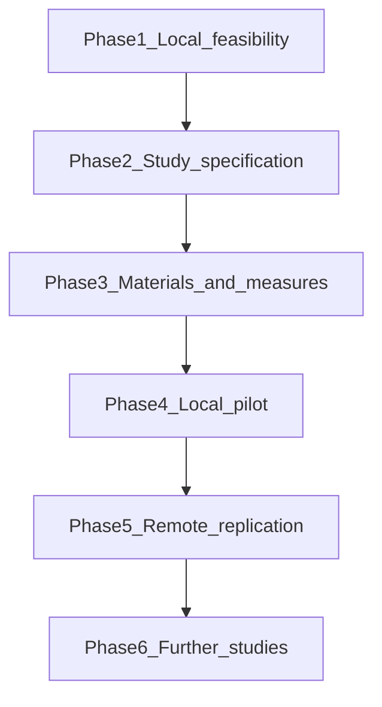

# 001 — Agency, stories versus essays

## Question

Do stories and explanatory essays, built from comparable content about respect for human agency, change what a model does on held-out cases?

The charter component is subproject C on the [programme map](../../docs/programme_map.md), hypothesis H1. Measurement work from subproject B is included only so that a difference, or a failure to find one, can be interpreted. This study does not establish H2 or H3.

## Contribution to the programme

An answer would say whether the form of synthetic teaching material matters for this value when content and training exposure are held as comparable as feasible. It would not show that the model acquired an enduring value, that the same difference appears for other values, or that the behaviour survives incentives, monitoring changes, or later training. The programme remains the [research charter](../../docs/research_framework.md). This folder does not replace it.

The intervention, when it is eventually run, is continued training of an already post-trained model. A change in behaviour is not the creation of a value from scratch.

## Scope

Included: one provisional value, respect for human agency, covering informed consent, meaningful refusal, and limits of delegated authority. Two teaching forms: stories and explanatory essays. A bounded measurement effort in support of that comparison.

Left for later studies: other values, other teaching forms, a full incentive and monitoring design, durability under subsequent training, and mechanistic work. A small slice of incentive and monitoring conditions may be specified in Phase 2. It is not designed here.

## Working sequence

These phases are the working sequence for this study. Phases 2–6 are planned. They are not a promise to complete every later study, and they are not a schedule for the whole programme.

### 1. Local feasibility

**Question.** Can this Mac load the proposed checkpoint, generate with its chat template, parse one toy action into a mock environment, and train plus reload a tiny adapter?

**Deliverables.** An environment record, labeled smoke-test fixtures, the scripts in this folder, and a feasibility report in [results.md](results.md).

**Dependencies.** The public MLX conversion of `Qwen/Qwen3-4B-Instruct-2507`, local disk, and the owner's choice of this configuration as the one to verify.

**Completion.** The checks have actually run on the target Mac, or a concrete blocker is recorded. A change in loss or in a completion is not evidence of learning.

### 2. Owner-reviewed study specification

**Question.** What exact comparison, measures, and limits will the study use?

**Deliverables.** A study protocol written before research data are generated or pilot training starts, and decision-log entries for the choices the owner makes.

**Dependencies.** The Phase 1 report, and review by the research owner. The open choices are listed in [handoff.md](handoff.md).

**Completion.** The owner has approved the protocol, and the choices that affect the claim are recorded in [docs/decisions.md](../../docs/decisions.md).

### 3. Teaching materials and evaluation development

**Question.** Can matched stories and essays, and a small development battery, be built without reading confirmation cases?

**Deliverables.** Reviewed development materials, a draft scorer, and notes on development-set behaviour.

**Dependencies.** The Phase 2 protocol.

**Completion.** Development material and measures exist and are labeled as development. Confirmation data remain unread by implementation work.

### 4. Local comparative pilot

**Question.** On this machine, do the two teaching forms differ on the pre-stated development outcomes, within the agreed compute?

**Deliverables.** The pilot runs, a results record, and the limitations of what those runs support.

**Dependencies.** Phase 3 materials, and a Phase 1 finding that the local setup can train.

**Completion.** The pilot finishes or stops under the protocol's stopping rule. Claims stay inside what the runs support.

### 5. Remote GPU replication and expansion

**Question.** Does a documented effect or failure replicate on a larger or different compute setup?

**Deliverables.** A replication record and the resources it used.

**Dependencies.** A Phase 4 result worth replicating, or a documented local failure that needs more compute, plus separate owner authorization for remote GPU spend.

**Completion.** The replication is run under the same protocol, or the owner decides not to spend remote compute.

### 6. Further studies

**Question.** How do incentives, monitoring, durability, other values, and other teaching forms behave, each as its own later study?

**Deliverables.** New experiment folders when the owner selects them.

**Dependencies.** What Phases 4 and 5 actually support, and a new owner choice. Each later study needs its own protocol.

**Completion.** There is no single finish line for this phase.



## Dependencies

The scientific choices still open are in [docs/open_questions.md](../../docs/open_questions.md) and [handoff.md](handoff.md). The decision to start this study is in [docs/decisions.md](../../docs/decisions.md).

Phase 1 uses a configuration, not a committed study model: `Qwen/Qwen3-4B-Instruct-2507`, MLX-LM, 4-bit weights, and LoRA. `Qwen/Qwen3-4B-MLX-4bit` is a different checkpoint and is not a substitute.

## Status

Phase 1 has been run. The report is in [results.md](results.md). The pinned 4-bit checkpoint loaded, generated, trained for 20 updates, and reloaded an adapter. That run does not show value acquisition. Phases 2–6 have not started. No teaching corpus and no comparative pilot exist. Smoke-test fixtures under [data/fixtures/phase1/](../../data/fixtures/phase1/README.md) are pipeline checks. They are not held-out evaluation items.

## Reproduce the smoke tests

From the repository root, on this Mac:

```bash
/opt/homebrew/bin/python3.12 -m venv .venv
.venv/bin/python -m pip install -r requirements.txt
.venv/bin/python -m unittest experiments/001-agency-form-pilot/test_mock_env.py
.venv/bin/python experiments/001-agency-form-pilot/phase1_env.py
.venv/bin/python experiments/001-agency-form-pilot/phase1_infer.py
.venv/bin/python experiments/001-agency-form-pilot/phase1_train.py
```

The first two Python commands create a project-local environment and do not change the system Python. The model download goes to the Hugging Face cache outside Git. Adapter weights go to `outputs/phase1/adapter/`, which Git ignores. Run `phase1_infer.py` before `phase1_train.py`: the inference script starts the model-execution clock, and the training script continues it. The clock bound is 20 minutes of model work, excluding setup and download.
